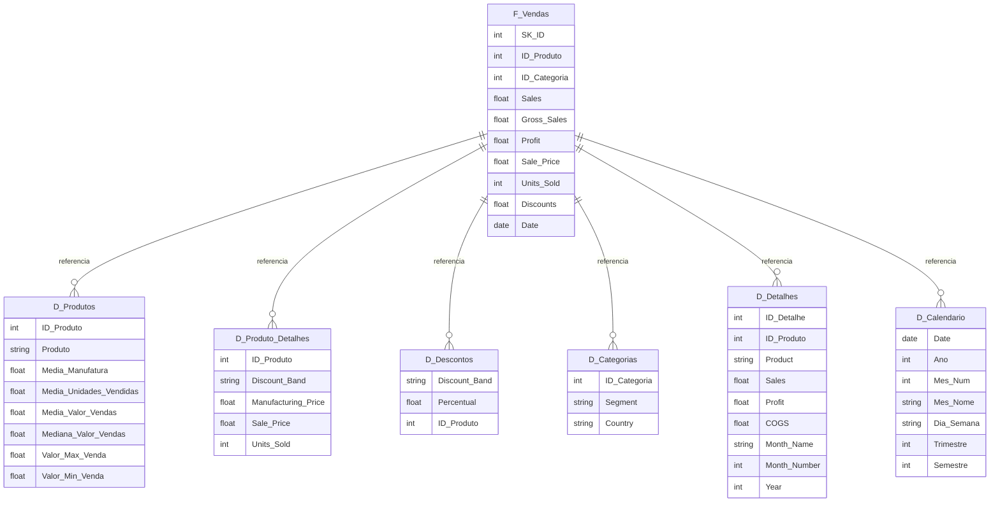

## 📊 Desafio DIO - Modelagem e Transformação de dados com DAX no Power BI


[](https://github.com/cristianorr38/Desafio-DIO-Relatorio-Gerencial-Vendas)
[](https://github.com/cristianorr38/Desafio-Modelagem-Transformacao-dados-DAX-Power-BI)


Este repositório contém a resolução do desafio de projeto focado na transformação de uma base de dados *flat* (tabela única) em um modelo **Star Schema**.  
O objetivo principal foi aplicar técnicas de **ETL** e **modelagem dimensional** para otimizar a performance e a usabilidade dos dados financeiros.

---

### 📌 Contexto do Desafio
A partir do dataset **Financial Sample**, foi necessário decompor a tabela única em tabelas de dimensão e uma tabela fato, garantindo que cada atributo descritivo fosse corretamente normalizado.

---

### 🏗️ Estrutura do Modelo Dimensional (Star Schema)

#### 1. Tabela Fato
**F_Vendas**: Contém as métricas de desempenho e as chaves estrangeiras.  
**Campos:** SK_ID, ID_Produto, Produto, Units Sold, Sales Price, Discount Band, Segment, Country, Sales, Profit, Date.

#### 2. Tabelas de Dimensão
- **D_Produtos**: Agrupamento de informações de vendas por produto.  
  *Métricas Calculadas:* Média de Unidades Vendidas, Média do Valor de Vendas, Mediana, Valor Máximo e Mínimo.

- **D_Produtos_Detalhes**: Detalhamento técnico dos produtos (Discount Band, Sale Price, Units Sold, Manufacturing Price).

- **D_Descontos**: Informações analíticas sobre descontos aplicados.

- **D_Detalhes**: Tabela complementar contendo atributos de vendas não contemplados nas outras dimensões.

- **D_Calendário**: Tabela dimensional de tempo criada via DAX.

#### 3. Tabela de Backup
**Financials_origem**: Mantida no modelo em modo oculto, servindo como base de segurança e *staging* para as demais transformações.

---

### 🛠️ Transformações e Funções DAX

#### Criação da Tabela de Calendário
Utilizei a função `CALENDAR()` para garantir uma dimensão temporal dinâmica e contínua:

```DAX
D_Calendar = 
VAR DataMinima = MIN(F_Vendas[Date])
VAR DataMaxima = MAX(F_Vendas[Date])
RETURN
ADDCOLUMNS (
    CALENDAR (DataMinima, DataMaxima),
    "Ano", YEAR([Date]),
    "Mês Num", MONTH([Date]),
    "Mês Nome", FORMAT([Date], "MMMM"),
    "Trimestre", "T" & FORMAT([Date], "Q"),
    "Dia da Semana", FORMAT([Date], "DDDD")
)
```

---

### 🛠️ Processos de ETL (Power Query)

- **Criação de Índices:** Implementação de índices condicionais para garantir a unicidade dos produtos.  
- **Agrupamento (Group By):** Utilizado na tabela D_Produtos para consolidar métricas estatísticas de vendas diretamente na carga dos dados.  
- **Condicionais:** Criação de colunas personalizadas para segmentação de índices de produtos.  
- **Reorganização:** Ordenação lógica das colunas para facilitar a leitura por ferramentas de visualização.  

---

📐  **Diagrama Dimensional (Star Schema)**

<br>

 &nbsp; **Diagrama Mermaid**



---

### ✅ Progresso do projeto

Progresso atual:  
`███████████████████████` **100% Concluído**

---

### 🚀 Como Visualizar o Projeto

1. Clone este repositório.  
2. Abra o arquivo `.pbix` no **Power BI Desktop**.  
3. Observe a aba **Modelo** para visualizar o diagrama em estrela e as relações (1:N) entre as dimensões e a fato.  

---

### 📦 Release Notes - v1.0.0

#### 🎯 Título
Versão Final - Desafio-Modelagem-Transformacao-dados-DAX-Power-BI

#### 👨‍💻 Autor
**Cristiano**  
Analista de Sistemas focado em **Data Science** e **Engenharia de Dados**.

#### 📝 Descrição
Esta é a primeira versão oficial do projeto **Desafio DIO - Modelagem e Transformação de dados com DAX no Power BI**.  
O projeto foi desenvolvido utilizando **Power BI Desktop**, com documentação completa no GitHub.

---

#### 📜 Licença
Este projeto está licenciado sob a **MIT License**.  
Sinta-se livre para usar, modificar e compartilhar, mantendo os créditos ao autor.
